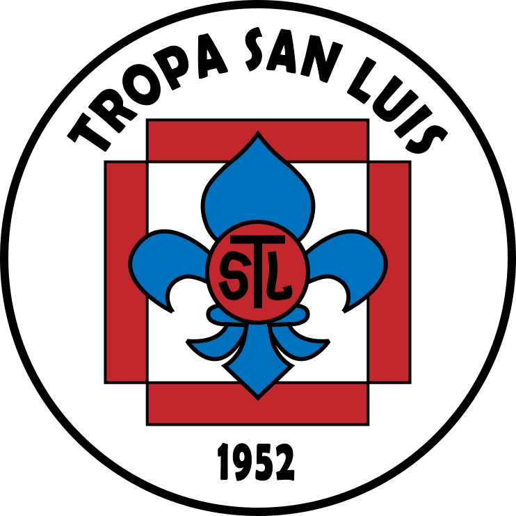

# Tropa San Luis - Página Web Oficial

<p align="center">
  
</p>

Bienvenido al repositorio oficial de la página web de la Tropa San Luis. Este proyecto tiene como objetivo mostrar la historia, actividades y espíritu de nuestra comunidad scout a través de una experiencia web moderna e interactiva.

## Sobre la Tropa San Luis

La Tropa San Luis es un grupo scout con una rica historia de campamentos, actividades y tradiciones. Nuestra página web sirve como punto central para compartir esta historia y conectar a miembros actuales, antiguos y futuros.

## Características de la Web

- **Historia**: Descubre la trayectoria de la Tropa San Luis.
- **Himnos**: Conoce nuestras canciones tradicionales.
- **Mapa de Campamentos**: Visualiza todos nuestros campamentos de verano a través de un mapa interactivo.

## Tecnologías

Este proyecto está construido con:

- **[Svelte](https://svelte.dev/)** y **[SvelteKit](https://kit.svelte.dev/)**: Framework para la construcción de interfaces de usuario.
- **[TailwindCSS](https://tailwindcss.com/)**: Framework de CSS para el diseño.
- **TypeScript**: Para un código más seguro y mantenible.

## Desarrollo

### Requisitos previos

- Node.js (versión recomendada: 18.x o superior)
- Yarn

### Instalación

```bash
# Clonar el repositorio
git clone https://github.com/tu-usuario/tropasanluis.git
cd tropasanluis

# Instalar dependencias
yarn install
```

### Desarrollo local

```bash
# Iniciar servidor de desarrollo
yarn dev

# O iniciar y abrir automáticamente en el navegador
yarn dev --open
```

### Compilación para producción

```bash
# Crear versión de producción
yarn build

# Previsualizar la compilación
yarn preview
```

## Despliegue

La página está alojada en [Netlify](https://www.netlify.com/) y puede accederse a través de:

- [https://tropasanluis.netlify.app/](https://tropasanluis.netlify.app/) (URL de despliegue)
- [https://tropasanluis.cl/](https://tropasanluis.cl/) (URL principal)

## Contribuciones

Valoramos y agradecemos cualquier contribución a este proyecto. Si deseas colaborar:

1. Haz un fork del repositorio
2. Crea una rama para tu funcionalidad (`git checkout -b feature/nueva-funcionalidad`)
3. Realiza tus cambios y haz commit (`git commit -m 'Añadir nueva funcionalidad'`)
4. Sube tus cambios (`git push origin feature/nueva-funcionalidad`)
5. Abre un Pull Request

## Agradecimientos

Agradecemos especialmente a [Alonso Valdes](https://github.com/Alonsomar) por la creación del [mapa interactivo de campamentos](https://github.com/Alonsomar/tropa_san_luis_map) que ha enriquecido enormemente nuestra página web.

## Licencia

Este proyecto está disponible como software open source bajo los términos de la licencia [MIT](https://opensource.org/licenses/MIT).

---

¡Porque somos Sanluisinos y Scouts de verdad!
